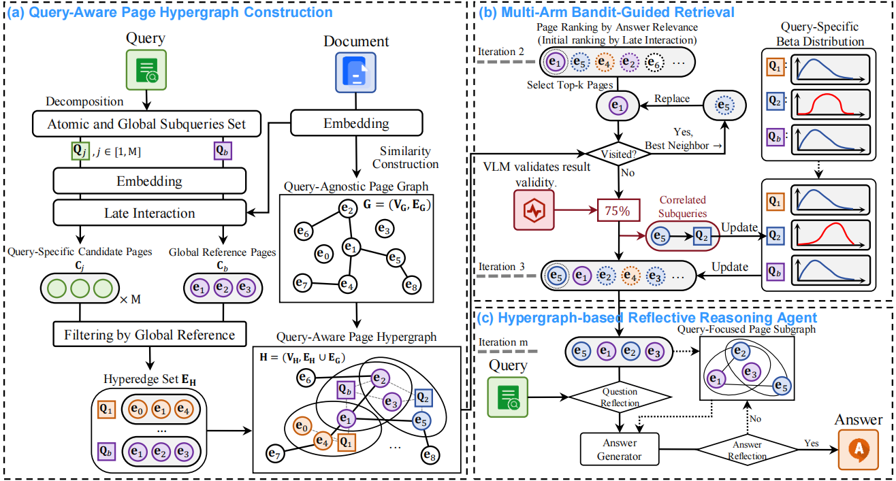

# MAB-DQA: Addressing Query Aspect Importance in Document Question Answering with Multi-Armed Bandits

> #### ACL 2026 (Main Conference🚀) | [📄 Paper](https://arxiv.org/pdf/2604.08952)

## Overview

> **Abstract:** \
Document Question Answering (DQA) involves generating answers from a document based on a user’s query, representing a key task in document understanding.
This task requires interpreting visual layouts, which has prompted recent studies to adopt multimodal Retrieval-Augmented Generation (RAG) that processes page images for answer generation. However, in multimodal RAG, visual DQA struggles to utilize a large number of images effectively, as the retrieval stage often retains only a few candidate pages (e.g., Top‑4), causing informative but less visually salient content to be overlooked in favor of common yet low-information pages.To address this issue, we propose a Multi-Armed Bandit–based DQA framework (MAB-DQA) to explicitly model the varying importance of multiple implicit aspects in a query.Specifically, MAB-DQA decomposes a query into aspect-aware subqueries and retrieves an aspect-specific candidate set for each.It treats each subquery as an arm and uses preliminary reasoning results from a small number of representative pages as reward signals to estimate aspect utility.Guided by an exploration–exploitation policy, MAB-DQA dynamically reallocates retrieval budgets toward high-value aspects. With the most informative pages and their correlations, MAB-DQA generates the expected results.



## 🐹 Installation

This repository has been developed and tested with `CUDA 11.7` and `Python 3.12`. Below commands create a conda environment with required packages. Make sure conda is installed.

1. Clone this repository and navigate to `MAB-DQA` folder

```bash
git clone https://github.com/ElephantOH/MAB-DQA.git
cd MAB-DQA
```

2. Install Package

```bash
chmod +x setup_env.sh && ./setup_env.sh
conda activate mab_dqa
```

## 🤖 Model Checkpoints

The models listed below can be downloaded from the Hugging Face Hub. Use the following commands to clone a repository:
```bash
# Install Git LFS if you haven't already
# git lfs install

# Clone the model repository
git clone https://huggingface.co/[REPO_ID]
```

The following table provides direct links to the Hugging Face repositories for each model checkpoint:

| Model Name                   | Hugging Face Location                                                             |
| ---------------------------- |-----------------------------------------------------------------------------------|
| colbertv2.0                  | [colbert-ir/colbertv2.0](https://huggingface.co/colbert-ir/colbertv2.0)           |
| colpali-v1.3-merged          | [vidore/colpali-v1.3-merged](https://huggingface.co/vidore/colpali-v1.3-merged)   |
| MoLoRAG-QwenVL-3B            | [xxwu/MoLoRAG-QwenVL-3B](https://huggingface.co/xxwu/MoLoRAG-QwenVL-3B)           |
| Qwen2.5-VL-7B-Instruct       | [Qwen/Qwen2.5-VL-7B-Instruct](https://huggingface.co/Qwen/Qwen2.5-VL-7B-Instruct) |
| Qwen3-VL-32B-Instruct        | [Qwen/Qwen3-VL-32B-Instruct](https://huggingface.co/Qwen/Qwen3-VL-32B-Instruct)   |

, and place it in the `checkpoints` directory.

Please browse all places with `{Enter the model weight address here.}` under the `config` folder (usually in the `base` file). Supplement the absolute address of the current project.

## 🎯 Fast Run

You can use the startup toolkit we provide to verify if the code is valid, using the code `python fast_run.py`. Please ensure that the `configs` is correct and the `checkpoints` have been downloaded.

```
from src.tools.close_domain_dqa.mab_retrieval_tools import MABRetrieverTools

if __name__ == "__main__":
    retriever = MABRetrieverTools(
        retriever_type="colpali/colpali-1.3",
        vlm_type="qwen/qwen25vl-7b",
        top_k=10,
    )
    while True:
        print("\n" + "-"*50)
        pdf_path = "examples/example.pdf"
        question = "what is total current assets in FY2023 for Bestbuy? Answer in million."
        try:
            pages, scores = retriever.retrieve(pdf_path, question)
        except Exception as e:
            print(f"Error: {e}")
```

## 🐼 Prepare Dataset

- Create a `datasets` directory, and:
    ```bash
    chmod +x setup_dataset.sh && ./setup_dataset.sh
    ```
- Download the dataset from [huggingface](https://huggingface.co/datasets/Lillianwei/Mdocagent-dataset) and place it in the `dataset` directory.

## 🐣 Retrieval

Run the following command:
```bash
python src/retrieval_mab.py
```

The inference results will be saved to:  
```
results/<mission>/<dataset>/sample<suffix>.json
```


## 🐧 Question Answering

**#TODO** The code refactoring is currently underway, and I will intensify the refactoring in the following parts

## 🐸 Evaluation

1. Add your OpenAI API key in `config/model/openai/gpt-4o.yaml`.

2. Run the `src/eval_rag.py`.

3. Run the `src/eval_qa.py`.

## 🐭 Citation

You are encouraged to modify/distribute this code. However, please acknowledge this code and cite the paper appropriately.

```bibtex
#TODO
```

---
